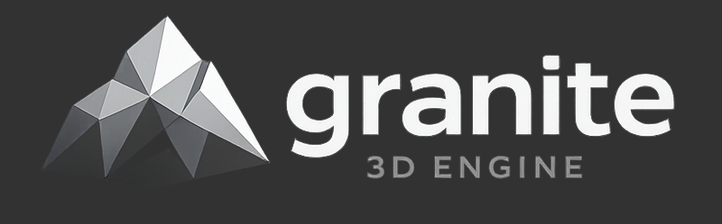
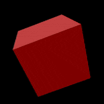

# 🚧 Project Archived — Learning Milestone

This project is no longer under active development.

This engine was created as a learning experience to explore and understand concepts such as graphics programming, engine architecture, rendering systems, and software design. Throughout its development, I gained valuable experience, discovered architectural limitations, and learned from the mistakes and decisions made along the way.

Although this project is not production-ready, it successfully achieved its main purpose: helping me understand what works, what does not, and what I want to improve in future projects.

I am moving forward with a new engine project built from scratch, using the knowledge gained here to create a cleaner, more scalable architecture and avoid the design issues I encountered during this development.

This repository will remain available as a record of my progress and as a reference for ideas, experiments, and lessons learned.

Thank you to this project for being part of my journey.

---

# 

)

---

**Granite** is a 3d game engine written in C++, its main goal is to make gamedev easy and enjoyable for everyone while keeping things simple and powerful.
feel free to use it to develop your game or to modify it, also, if you want to contribute, just fork it and create a pull request!
if you find any issue or have a cool idea/suggestion, share it on github issues or send me an e-mail!

---

### 🚀 Features:
- 3D Rendering
- Transforms
- Custom Meshes
- Primitives
- 3D Audio
- Custom Shaders
- Lights
- Window Management
- Keyboard & Mouse Input
- 3D Physics
- Models
- Map Loading
- Math & Vector Modules

---

### 📞 Contacts:
[E-Mail](mailto:hiqkrs@gmail.com)

---

### 📜 Documentation:
[Site](https://saintshr.github.io/Granite/)

---

Copyright (c) 2026 saintsHr
Licensed under the MIT License
Github: https://github.com/saintsHr/Granite

---
